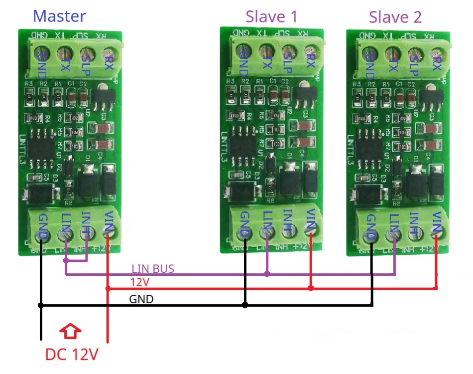
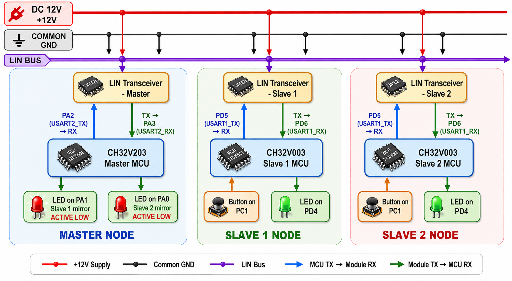
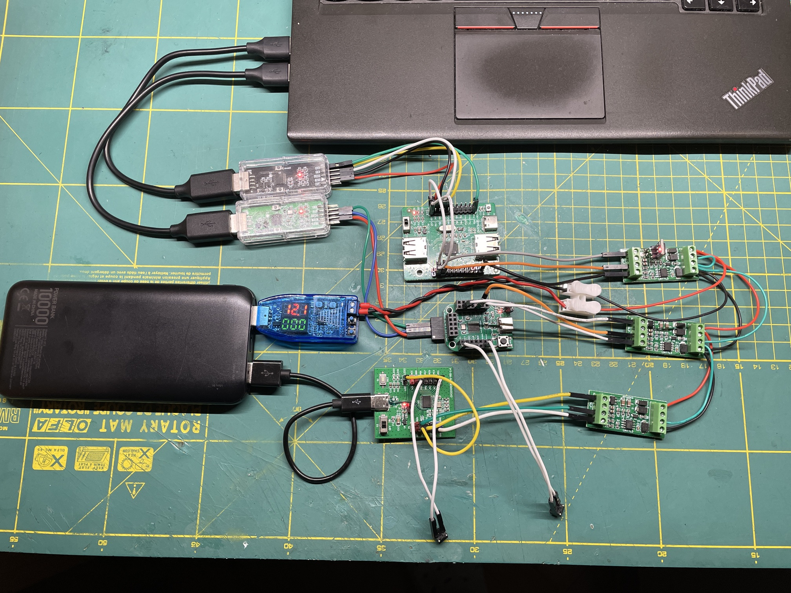
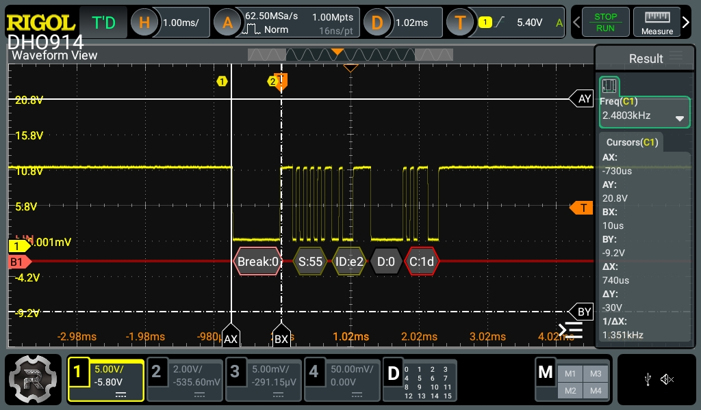

# CH32 LIN Bus Demo: 1 Master + 2 Slaves

A simple **LIN bus demo** built with WCH microcontrollers and LIN transceiver modules.

This project shows how one **master node** polls two **slave nodes** over a shared **12 V LIN bus**.  
Each slave reads a push button and drives its local LED. The master reads both slave states and mirrors them on its own LEDs.

## Features

- **1 LIN master + 2 LIN slaves**
- **LIN bus at 19200 baud**
- **Master polling architecture**
- **Slave 1 button state mirrored to master LED on PA1**
- **Slave 2 button state mirrored to master LED on PA0**
- **PID and enhanced checksum validation**
- **Master MCU CH32V203C8T6 running from internal 96 MHz clock**
- **Slave MCUs CH32V003F4P4 running from internal 48 MHz clock**

---

## System Overview

### TJA1021 LIN modules used in the test

### Block diagram

### Bench test setup :)

---

## How it works

- The **master node** periodically sends a LIN header to **Slave 1** and **Slave 2**
- Each **slave node**:
  - reads a push button on **PC1**
  - drives a local LED on **PD4**
  - returns one data byte with the button state
- The **master node**:
  - validates **PID echo**
  - validates **enhanced checksum**
  - updates:
    - **PA1** for Slave 1
    - **PA0** for Slave 2
   
### LIN frame

### Logic summary

- **Slave button pressed** → slave sends `1`
- **Slave local LED** turns ON
- **Master mirror LED** for that slave turns ON

---

## Wiring

### LIN bus side
All three LIN transceiver modules are connected together:

- **LIN** → common LIN bus
- **VIN** → common **+12 V**
- **GND** → common ground

### Master node
**MCU:** CH32V203  
**Clock:** internal **96 MHz**  
**LIN UART:** USART2

- **PA2** → LIN module **RX**
- **PA3** ← LIN module **TX**
- **PA1** → Slave 1 mirror LED
- **PA0** → Slave 2 mirror LED

### Slave 1 node
**MCU:** CH32V003  
**Clock:** internal **48 MHz**  
**LIN UART:** USART1

- **PD5** → LIN module **RX**
- **PD6** ← LIN module **TX**
- **PC1** ← push button
- **PD4** → local LED

### Slave 2 node
**MCU:** CH32V003  
**Clock:** internal **48 MHz**  
**LIN UART:** USART1

- **PD5** → LIN module **RX**
- **PD6** ← LIN module **TX**
- **PC1** ← push button
- **PD4** → local LED

---

## Hardware used

- 1× **CH32V203** board as LIN master
- 2× **CH32V003** boards as LIN slaves
- 3× **LIN transceiver modules**
- 12 V supply for the LIN bus
- Push buttons and LEDs
- USB-UART / USB programming tools

---

## Notes

- The LIN bus is powered from **12 V**
- All nodes must share a **common ground**
- The master uses a software-generated LIN break compatible with this hardware setup
- The master runs from the internal **96 MHz** clock
- Both slave nodes run from the internal **48 MHz** clock
- This project is intended as a compact practical example for learning and testing LIN communication

> [!IMPORTANT]
> On the **master LIN transceiver module**, the onboard **LM7805 regulator must be replaced with a 3.3 V version**, because the **CH32V203 is not 5 V tolerant**.  
> Alternatively, use a **logic level shifter** on the **RX and TX lines**.

---

> [!TIP]
> This project can also be extended to **bidirectional control**.  
> If two push buttons are added to the **master node** (for example on **PA4** and **PA5**), the master can not only read button states from both slaves, but also **control the slave LEDs** over LIN.  
> Source code for this variant is provided in a **separate directory**, so it can be tested as an alternative version of the demo.

---

## Project purpose

This repository is an example of:

- LIN master/slave communication
- multi-node bus wiring
- button-to-LED state transfer
- WCH MCU based embedded networking experiments

If you are learning LIN or testing low-cost LIN hardware modules, this project can be a good starting point.
